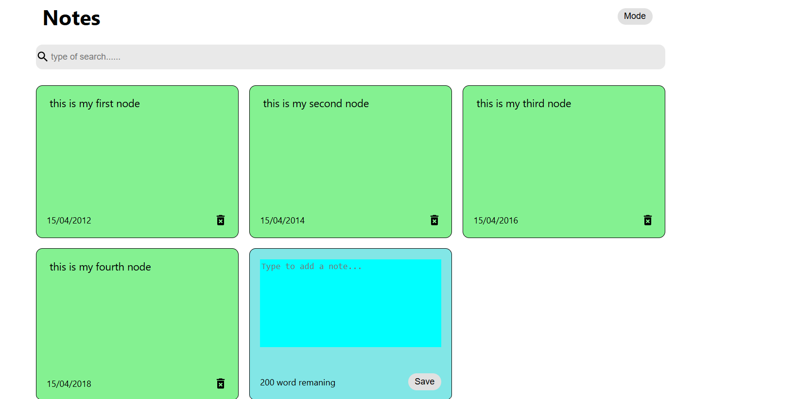

# 📝 Notes App

A simple and responsive Notes App built to help users create, edit, and delete notes with ease. Ideal for quick jotting, task tracking, and personal reminders.

# 📝 Detailed Description
This Notes App is a full-stack application built using the MERN (MongoDB, Express.js, React.js, Node.js) stack. It allows users to create, update, delete, and view notes in an intuitive interface. The frontend is built with React, ensuring fast and responsive user interactions, while the backend uses Express and MongoDB for efficient data handling and storage. It supports features like rich text editing, timestamp tracking, and persistent storage. The project follows a clean folder structure, and is ideal for learning or extending with authentication, cloud hosting, or additional features like reminders or categories.

## 🔧 Features

- ➕ Create new notes
- ✏️ Edit existing notes
- ❌ Delete notes
- 🌙 Light/Dark mode toggle (optional)
- 💾 Local storage or backend persistence
- 🔍 Search/filter functionality

## 🚀 Tech Stack

- **Frontend:** HTML, CSS, JavaScript *(or React, Vue, etc. based on your implementation)*
- **Backend (optional):** Node.js, Express, MongoDB/Firebase
- **Other:** LocalStorage / REST API / JWT (if implemented)

## 📸 Screenshots



## 📦 Installation

1. Clone the repo:
   ```bash
   git clone https://github.com/mishrav0090/NotesApp
